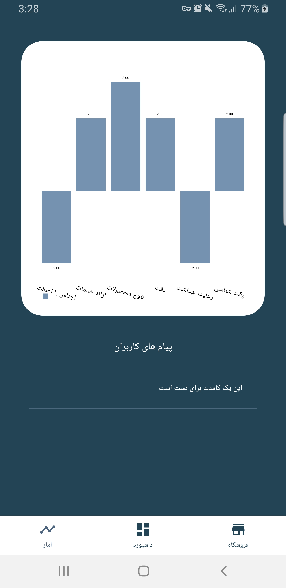

# Best Sellers

  
### Introduction

**Best Seller** is an android application designed to be a relation between customers and sellers.  
In this application sellers and customers can have a profile and customers can share their opinion about specific shop. Customer can give point according specified criterias to shop and also they can search for shops according those criterias or place. For example customers can search about shops, they are clear and sell original product.  
In sellers work-space, sellers can see a chart, shows average of user points and user comments. Sellers can define discount to persuade users give point and participate in survey.Each shop can have one QR code and users can search QR code and show detail of shop.  
And finally users can use google maps to find shortes way to arrive favorite shop.  

 
  
  &nbsp;&nbsp;
  
  &nbsp;&nbsp;
  
    

  
  
  
  &nbsp;&nbsp;
  
  &nbsp;&nbsp;
  
    

  
  &nbsp;&nbsp;
  
  &nbsp;&nbsp;
  
    

  
  &nbsp;&nbsp;
  

  
  
  ### Contribute
  If you want to contribute in this project you can go on this steps:  
  1. Fork project in your github account
  2. Clone porject
  3. Make branch whith issue or feacher name and do changes
  4. Commit your change in your github
  5. Send me pull request  
  
  *I Will be glad if you contribute and improve project :beers: :seedling:*

